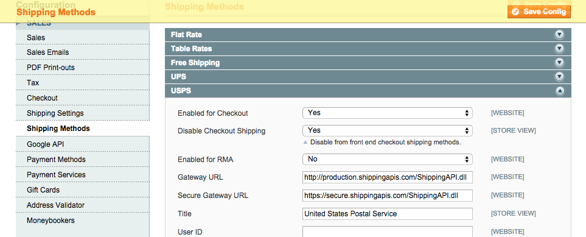

Disable Checkout Shipping
========================

Disable specific shipping methods from displaying on the checkout. Disabled methods will still be enabled in the admin
and can be used to create orders in the admin.

How to use
----------

Go to the admin in System -> Configuration -> Sales -> Shipping Methods, select the shipping method you want to
disable, and set Yes to the Disable Checkout Shipping dropdown.

